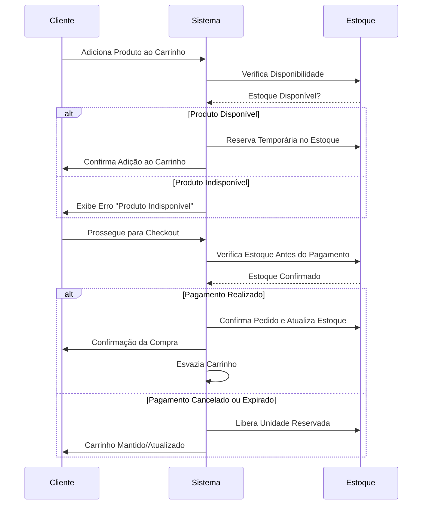

```mermaid
sequenceDiagram
    participant Cliente
    participant Sistema
    participant Estoque
    
    Cliente->>Sistema: Adiciona Produto ao Carrinho
    Sistema->>Estoque: Verifica Disponibilidade
    Estoque-->>Sistema: Estoque Disponível?
    alt Produto Disponível
        Sistema->>Estoque: Reserva Temporária no Estoque
        Sistema->>Cliente: Confirma Adição ao Carrinho
    else Produto Indisponível
        Sistema->>Cliente: Exibe Erro "Produto Indisponível"
    end
    
    Cliente->>Sistema: Prossegue para Checkout
    Sistema->>Estoque: Verifica Estoque Antes do Pagamento
    Estoque-->>Sistema: Estoque Confirmado
    
    alt Pagamento Realizado
        Sistema->>Estoque: Confirma Pedido e Atualiza Estoque
        Sistema->>Cliente: Confirmação da Compra
        Sistema->>Sistema: Esvazia Carrinho
    else Pagamento Cancelado ou Expirado
        Sistema->>Estoque: Libera Unidade Reservada
        Sistema->>Cliente: Carrinho Mantido/Atualizado
    end
```
