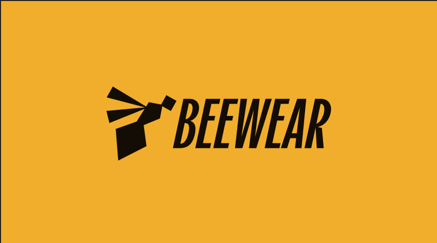
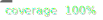

  

<h1 align="center">
  
  Beewear – Loja de Roupas Fitness
</h1>

  Plataforma moderna para gestão e venda de roupas fitness. 

---

## 📁 Repositórios

| Projeto                                              | Descrição                                        |
| ---------------------------------------------------- | ------------------------------------------------ |
| [`beewear-api`](#-api-backend---nestjs)              | Backend da aplicação, com NestJS, TypeORM e JWT  |
| [`beewear-admin`](#-frontend-admin---react--mantine) | Painel de gestão para produtos, estoque e vendas |

---

## 📦 API Backend – NestJS

  

### Tecnologias

         

### Funcionalidades

- ✅ Cadastro de produtos e variações
- ✅ Upload de imagens com suporte a S3 no futuro
- ✅ Gestão de estoque
- ✅ Gestão de coleções
- 🔐 Autenticação com JWT
- 📄 Documentação automática com Swagger

---

## 🧑‍💻 Frontend Admin – React + Mantine

### Tecnologias

     

### Funcionalidades

- 🧾 Cadastro e edição de produtos e variações
- 🖼️ Upload de imagens via painel
- 📦 Controle e visualização de estoque
- 🗂️ Gestão de coleções
- 🔐 Login com token persistido